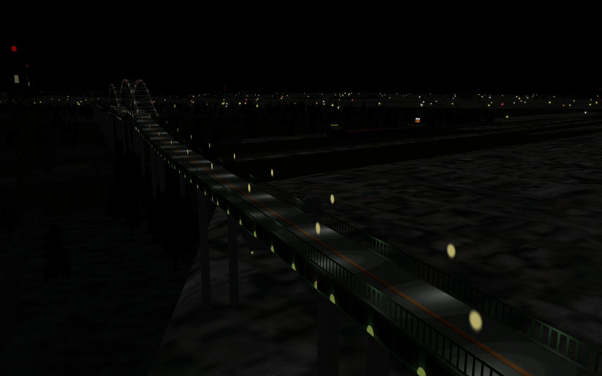
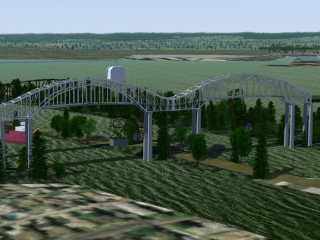
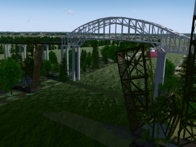
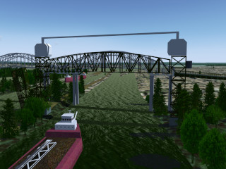
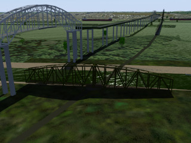
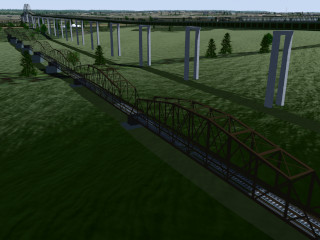

3D models of Sault Ste. Marie International Bridges
===================================================

Low-fidelity model of the complex international rail bridge and automobile bridge between Sault Ste. Marie, Ontario (Canada) and Sault Ste. Marie, Michigan (U.S.), suitable for use in flight simulators (where it will rarely be viewed close-up).  While it's not intended for driving simulators, there is a continuous roadway.




Background on the rail bridges: https://historicbridges.org/bridges/browser/?bridgebrowser=truss/internationalrail/

Closest airport: [Sanderson Field](https://ourairports.com/airports/KANJ/) (KANJ).


## Models

All of the ``*.ac`` and ``*.png`` files go into the scenery directory ``Objects/w090n40/w085n46/``

The ``OBJECT_STATIC`` lines go into the file ``1565218.stg`` in the same directory.

For other applications, the numbers after the filename in the ``OBJECT_STATIC`` line are longitude, latitude, elevation (metres) and heading (degrees).

### Automobile bridge



The Sault Ste Marie International Bridge for cars and trucks.

```
OBJECT_STATIC soo-auto-bridge.ac -84.36141500 46.50661663 186.8689 165.0
```

### Rail double-Bascule bridge



The rail double Bascule bridge (drawbridge), across the north passage into the American locks.  You need to position two of these facing each other.

```
OBJECT_STATIC soo-bascule-bridge.ac -84.36334670 46.50354941 184.8447 167.5
OBJECT_STATIC soo-bascule-bridge.ac -84.36341883 46.50343495 184.8837 347.6
```

### Rail lift bridge



The rail lift bridge across the south passage into the American locks.

```
OBJECT_STATIC soo-lift-bridge.ac -84.36379784 46.50233261 187.8692 348.0
```

### Rail swing bridge



The rail swing bridge across the passage to the Canadian locks.

```
OBJECT_STATIC soo-swing-bridge.ac -84.35952360 46.51329176 181.5378 85.9
```

### Rail truss bridges



The long span of 9 rail truss bridges across the rapids.

```
OBJECT_STATIC soo-truss-bridges.ac -84.36204158 46.50729534 184.8495 346.1
```

## Changes

### 2024-09-28

- standardised names and reorganised directories for consistency
- added screenshots and thumbnails

### 2024-09-27

- all bridges complete and textured (no lighting yet)

### 2024-09-21

- 9-span truss section complete.

## UNLICENSE

This model is in the public domain.  See UNLICENSE.md for details.
